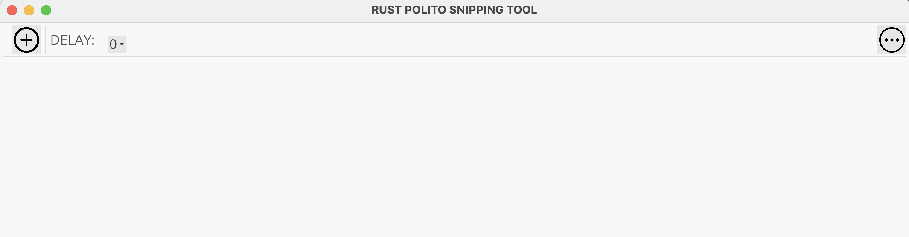
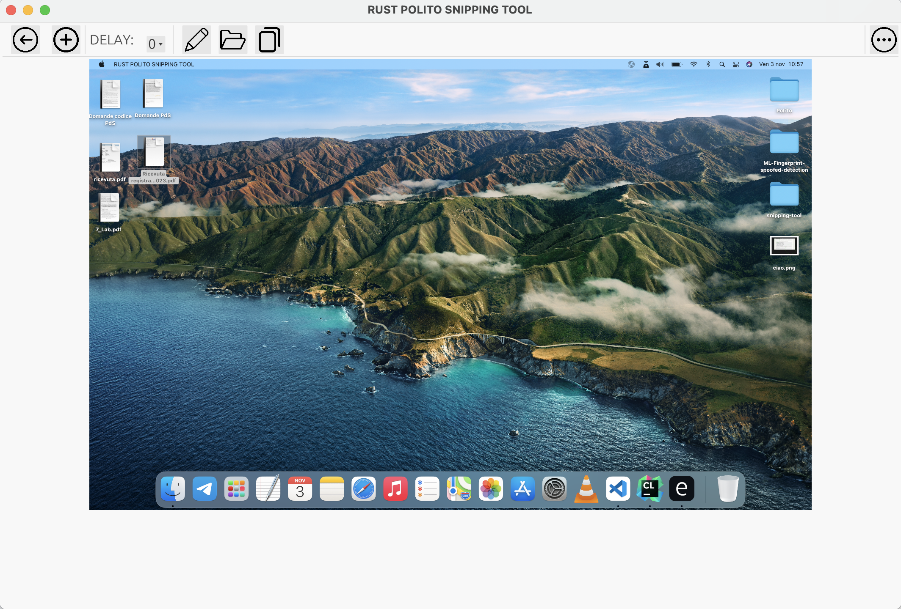

# RUST POLITO SNIPPING TOOL

An easy-to-use screen grabber, written in pure Rust using eframe and egui for GUI. Cross-platform between Windows, macOS, Linux 

## Getting Started
Just clone the repo from GitHub 
```
git clone https://github.com/ethan-morleo/snipping-tool.git
```
### Prerequisites

To use on linux first run:

```
sudo apt-get install libxcb-render0-dev libxcb-shape0-dev libxcb-xfixes0-dev libxkbcommon-dev libssl-dev
```
For linux native-dialog requires either Zenity or Kdialog to be installed.
### Installing
Just build and run the project 

```
cargo build;
cargo run
```
## Built With

* [eframe](https://github.com/emilk/egui/tree/master/crates/eframe) - the GUI framework based on egui
* [egui](https://github.com/emilk/egui) - pure Rust GUI library 
* [image]() - used for managing images 
* [screenshots]() - library for taking screenshots 

## SCREEN OF THE APP 

**Home page**

**Choice Screen**

**Processed Image**



## Authors

* **Ethan Morleo**
*  **Michael Di Giorgio**

## License

This project is licensed under the MIT License 

## Acknowledgments

* Hat tip to anyone whose code was used
* Inspiration
* etc

